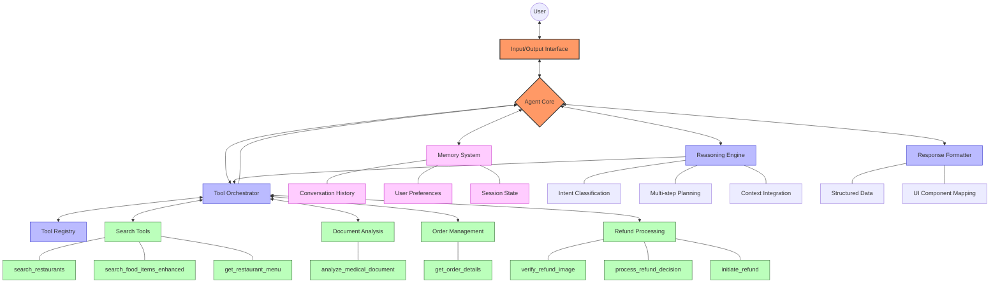

# Swiggy AI Agent Architecture

This diagram illustrates the dynamic, non-linear architecture of the Swiggy AI Assistant. The diagram shows how different components interact with each other, enabling complex workflows that involve multiple tools working together.

## Key Architectural Elements

- **Hub-and-Spoke Design**: The Agent Core acts as a central hub with bidirectional connections to all major subsystems
- **Dynamic Tool Selection**: Tool Orchestrator selects from the Tool Registry based on reasoning outcomes and context
- **Concurrent Processing**: Multiple components can be active simultaneously when appropriate
- **Feedback Loops**: Results from tools feed back into the reasoning engine to trigger additional tool calls
- **Memory Integration**: The memory system influences all aspects of processing

This architecture allows complex workflows like:
- Medical document analysis triggering food searches while checking user preferences
- Order and refund tools working together while accessing order history
- Iterative search refinement based on partial findings
