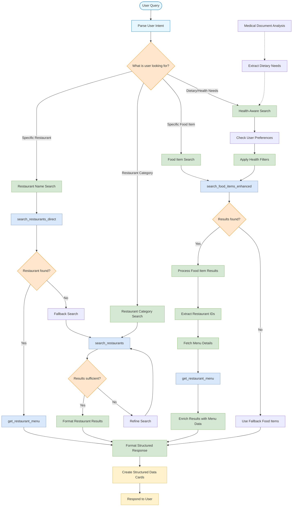

# Food Search Chain-of-Thought Workflow

This flowchart illustrates the decision-making process and chain of tools used by the Swiggy AI Assistant when processing food and restaurant search requests.

## Key Chain-of-Thought Decision Points

### 1. Intent Classification
The agent first determines what the user is looking for:
- Specific restaurant by name (e.g., "Find Domino's Pizza")
- Restaurant category (e.g., "Show me popular restaurants")
- Specific food item (e.g., "I want vegetable soup")
- Health-based suggestions (e.g., "Healthy food options for diabetics")

### 2. Multi-Stage Tool Selection
Based on the intent classification, the agent selects an appropriate tool chain:

**Restaurant Search Chain:**
- `search_restaurants_direct` for specific restaurant names
- `search_restaurants` for browsing by category
- `get_restaurant_menu` to fetch detailed menu information

**Food Item Search Chain:**
- `search_food_items_enhanced` to find specific dishes across restaurants
- Extract restaurant IDs from food search results
- `get_restaurant_menu` to enrich results with complete menu context

**Health-Aware Chain:**
- Check memory for user preferences and restrictions
- Apply health filters to search criteria
- Connect with medical document analysis when applicable
- Use specialized food search with health parameters

### 3. Adaptive Response Strategy
The agent adapts its search strategy based on initial results:
- Use fallback searches when primary search returns no results
- Refine search parameters to improve relevance
- Switch between search types when appropriate
- Apply result enrichment for more comprehensive information

### 4. Response Formatting
After completing the search chain, results are organized into structured data:
- Restaurant cards with ratings, cuisines, and delivery times
- Food item cards with prices, descriptions, and images
- Special formatting for health-related information
