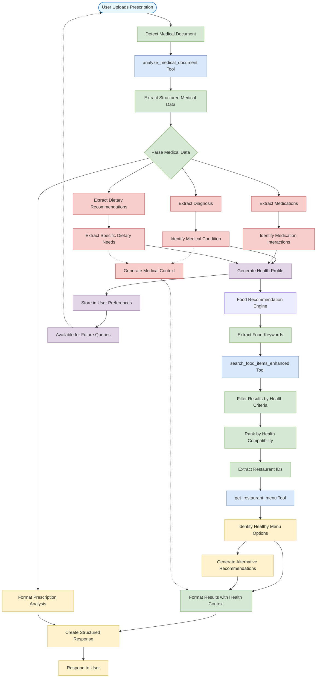

# Medical Prescription Analysis Workflow

This flowchart illustrates the specialized workflow for processing medical prescriptions and generating food recommendations based on medical conditions.

## Key Workflow Components

### 1. Document Analysis Phase
- Detects and analyzes uploaded medical prescription images
- Uses the `analyze_medical_document` tool to extract structured data
- Parses diagnosis, medications, and dietary recommendations
- Identifies specific health conditions and restrictions

### 2. Health Profile Generation
- Compiles extracted medical data into a cohesive health profile
- Identifies food interactions with medications
- Determines dietary needs based on diagnosed conditions
- Stores information in memory for future interactions

### 3. Food Recommendation Phase
- Extracts food-related keywords based on health requirements
- Uses `search_food_items_enhanced` to find appropriate food options
- Applies health criteria filtering to search results
- Ranks results by compatibility with medical needs

### 4. Restaurant Menu Analysis
- Extracts restaurant IDs from food search results
- Uses `get_restaurant_menu` to obtain detailed menu information
- Identifies menu items matching health requirements
- Generates alternative recommendations when necessary

### 5. Contextual Response Formation
- Creates structured data cards with medical context
- Provides explanations linking medical conditions to food choices
- Formats results with health-specific information highlighting
- Delivers personalized response with both medical analysis and food recommendations

### 6. Memory Integration
- Stores user health profile for future interactions
- Enables consistent health-aware recommendations across sessions
- Allows for follow-up questions about dietary restrictions

This specialized workflow enables the agent to process medical documents and translate them into actionable food recommendations, creating a seamless experience between healthcare information and food ordering.
