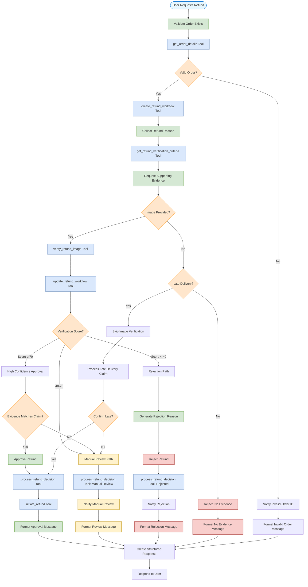

# Refund Verification Workflow

This flowchart illustrates the structured workflow for handling refund requests, including the verification process and decision points.

## Key Refund Workflow Components

### 1. Order Validation Phase
- Verifies order exists using `get_order_details` tool
- Creates a structured refund workflow with `create_refund_workflow`
- Collects specific refund reason from user
- Determines verification criteria based on refund reason

### 2. Evidence Collection Phase
- Requests specific supporting evidence based on reason type
- Handles special cases like late delivery (no image required)
- Rejects claims requiring evidence when none is provided

### 3. Verification Analysis Phase
- Processes uploaded images with the `verify_refund_image` tool
- Updates workflow state with `update_refund_workflow` tool
- Generates verification score based on multiple factors:
  - Image clarity
  - Evidence relevance to claim
  - Timestamp validation
  - Order details match

### 4. Decision Logic Phase
- Implements strict approval conditions:
  - Verification score ≥ 70
  - Evidence clearly matches claim
  - Evidence shows significant issue
- Routes to manual review for:
  - Verification score between 40-70
  - Ambiguous or partial evidence
  - Subjective claims (e.g., taste, temperature)
- Rejects when:
  - Verification score < 40
  - No evidence for required claims
  - Evidence contradicts claim
  - Suspicious patterns detected

### 5. Processing and Communication Phase
- Uses `process_refund_decision` to record decision and reasoning
- Processes approved refunds with `initiate_refund` tool
- Generates appropriate communication for each outcome:
  - Approval: Confirmation and next steps
  - Manual review: Timeline and expectations
  - Rejection: Clear explanation with specific reasons
  - Invalid order: Troubleshooting guidance

This structured workflow ensures consistent, evidence-based refund handling with transparency across the entire process. The agent maintains context throughout multiple turns of conversation, creating a streamlined experience for resolving customer issues.
