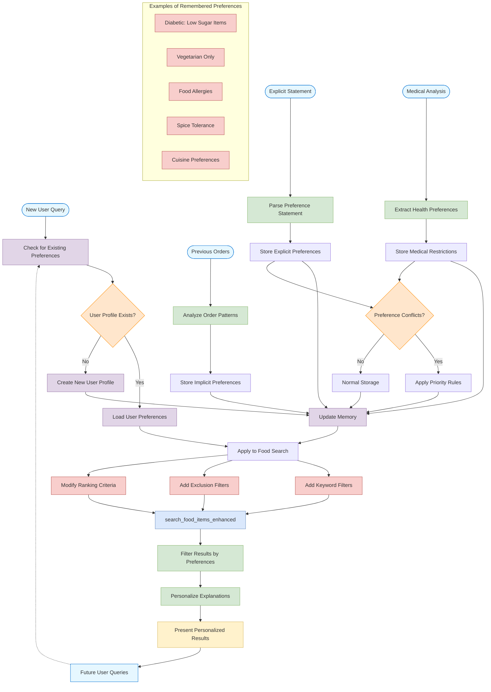

# User Preference Memory Workflow

This flowchart illustrates how the Swiggy AI Assistant remembers and applies user preferences across conversations, creating a personalized experience for dietary restrictions.

## Key Memory System Components

### 1. Multiple Data Collection Paths
- **Explicit statements**: Direct user statements like "I'm vegetarian" or "I can't eat gluten"
- **Medical analysis**: Dietary needs extracted from uploaded prescriptions or health documents
- **Order history analysis**: Implicit preferences derived from ordering patterns
- **Real-time conversation**: Preferences mentioned during current conversation

### 2. Preference Storage Hierarchy
- **Medical restrictions** (highest priority): Health-critical restrictions from verified documents
- **Explicit preferences** (high priority): Clearly stated user preferences
- **Implicit preferences** (medium priority): Derived from behavior patterns
- **Temporary preferences** (low priority): One-time preferences for current session only

### 3. Conflict Resolution System
- Resolves contradictory preferences by applying priority rules
- Medical restrictions override other preferences for safety
- Recent preferences take precedence over older ones
- Explicit statements override implicit patterns

### 4. Memory Integration Points
- **Search modification**: Adds filters and modifies search parameters
- **Result filtering**: Post-processes search results to enforce preferences
- **Result ranking**: Re-ranks results to prioritize preference-matching items
- **Personalized explanations**: Adds context about why items were recommended

### 5. Types of Remembered Preferences
- **Dietary restrictions**: Vegetarian, vegan, gluten-free, etc.
- **Health conditions**: Diabetes, hypertension, allergies, etc.
- **Taste preferences**: Spice level, sweetness, cuisines, ingredients
- **Ordering habits**: Favorite restaurants, regular orders, usual order times

This memory system creates a persistent, personalized experience across sessions, making the agent more helpful over time as it learns user preferences and medical needs.
